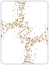

#  Archeologist Mod

This mod is a test, and adds:

# **3 New Jokers :**

1. **Archeologist *(Rare)*** : Has the same effect as blueprint or brainstorm, but for cards that were at it's position at the end of last run.  ⚠️*It sometimes doesn't copy some jokers or can crash the game*
2. **Brush *(Common)*** : when first hand is a single Sandy card, remove the sand and turn it into a new enhanced card (*enhanced + seal + edition*)  ➡️*The brush pixel art comes from the **Faithful java 64x texture pack** for Minecraft [get it here](https://faithfulpack.net)*

3. **Sandy Joker *(Uncommon)*** : Multiplies the blind size by X0.02 for each **Sandy Card** in your full deck (starting at X1). 

  
# **A New Enhancement:**

 **Sandy Cards** : Multiplies the blind X0.95 when the card is scored.

# **Tarots:**
  * Desert --> makes 2 Sandy cards
  * Excavation --> 2/3 chance to get 50$; a very bad surprise otherwise
* **Seal:** Scarab Seal --> different effects depending on position in played hand (1st=+20c and +3m ; else=+2$ ; last=X1.3m)
* **Spectral:** Artefact --> applies a Scarab Seal to a card
* **Blind:** The Fossil --> flames effects will break it (-15$)
* **Deck:** Museum Deck --> Rewards you based on your joker's rarity (common=1$, uncommon=2$, rare=4$, legendary=1 spectral)
* **Tag:** Review --> retriggers ALL scored cards and in hand effects for 1 round

**WIP:**
* **Vouchers:** Inspiring Movie (copies consummables ? give them back ?) / Grand Thesis (lvl 2 version, effect ?)
* **Sticker + Stake:** Maybe ?
* **Edition:** Need to figure out shaders...

*I'm looking for feedback on balance, localization and sprites so feel free to do so! :)*
